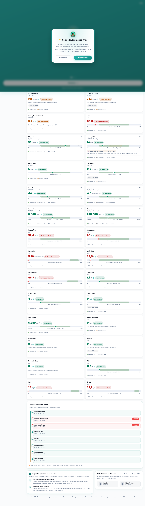

# Guia Completo de Mudanças — Dr. Exame (Out/2026)

> Passeio detalhado por TODA mudança visível, na ordem em que você encontra no app. Cada item: **onde clica → o que vê → o que mudou → como saber que está certo**.
> Screenshots do modo esportivo: `screenshots/` nesta pasta. Roteiro de teste rápido: `ROTEIRO-DE-TESTE.md`.

---

## 1. Pagamentos (já no ar desde 04-05/10)

### 1.1 PIX — cadeia de 3 provedores com fallback
- **Onde**: App → Comprar créditos (ou /planos) → escolhe pacote → PIX
- **O que acontece**: cobrança ≥R$5 nasce pelo **Asaas**; se falhar (ou <R$5) → **OpenPix** automaticamente → resgate final MP
- **Como saber que está certo**: QR + copia-e-cola aparecem em ~3s; pagou → crédito cai sozinho em segundos (webhook)
- **Mudou por dentro**: customer do Asaas agora nasce com seu CPF (corrigia 400); webhook Asaas registrado na conta (PAYMENT_RECEIVED)

### 1.2 Cartão de crédito INLINE (estreia)
- **Onde**: mesmo fluxo → "Cartão de crédito"
- **O que vê**: **form dentro do app** (não abre mais site do Mercado Pago): número com máscara e bandeira automática, validade, CVV (o cartão 3D VIRA no foco do CVV), CPF e CEP (CEP autocompleta o endereço)
- **Como saber**: cartão digitado errado → erro do Asaas em português na hora ("Cartão recusado..."); aprovado → crédito instantâneo; se seu banco pedir 3DS → tela de autenticação → volta e credita
- **Segurança**: número/CVV nunca ficam salvos nem em log (só ****1234)

### 1.3 Premium por PIX/cartão
- **Onde**: /planos → botão do plano mensal
- **Mudou**: antes ia pro site do MP (morto); agora PIX ou cartão inline, mesma UX dos créditos

## 2. Identidade visual

### 2.1 Aura pulsante do robô
- **Onde**: tela de **login** (topo) e **menu → Sobre**
- **O que vê**: anéis claros nascem do círculo do robô e expandem, contínuos (efeito "vivo" de app nativo)
- Igual nos modos claro/escuro; desativa se o sistema tem "reduzir movimento"

### 2.2 Login com cara de app nativo
- Faixa teal no topo com robô + **folha branca subindo** por cima (radius 32) — o formulário "mora" na folha como nos apps de banco

## 3. Exames

| Mudança | Onde ver | Como saber |
|---|---|---|
| **Entrada suave** (fade-in) | abrir /exames | lista aparece com fade ~1s (sem "pulo" do skeleton) |
| **Exames antigos em P&B** | /exames | exames com mais de 1 ano ficam sem cor + levemente apagados — o olho vai pros recentes |
| **Modo privacidade** 🙈 | Perfil → Preferências → ativar | nomes de exames ficam **borrados** na lista; toque no nome → revela por 5s e borra de novo |
| **Enviar diagnóstico** 📋 | Perfil → Preferências | abre compartilhamento do celular com versão+erros da sessão (sem dados pessoais) |

## 4. Engajamento

- **Quiz recompensado**: card no dashboard anuncia "~30s · 3 perguntas · +5 créditos"; **se sair no meio, volta de onde parou** (barra de progresso)
- **Indique e ganhe** (/indique): "Você ganha X · seu amigo ganha Y" (valores editáveis no admin); **"Já tenho um código"** — quem recebeu código por voz/papel cola na tela de registro
- **Carteira** (/carteira): saldo + extrato com **filtros** (Ganhos/Gastos)
- **Sem bombardeio**: modais informativos agora fazem FILA — um por vez, com respiro entre eles

## 5. SAÚDE ESPORTIVA — o modo novo 🏋️ (liga em 3 chaves)

### 5.1 Admin liga (1x)
Admin → **Config** → categoria `sportsMode` → `enabled=1` → salvar (live, sem deploy). Desligar = tudo some na hora.

### 5.2 Paciente premium ativa
Perfil → Preferências → **Saúde Esportiva**:
- Conta FREE → "Disponível no Premium" (CTA pro plano)
- Premium → toggle → **wizard**: esporte (musculação/corrida/...) · nível (Recreativo/Amador/Alta performance) · frequência · objetivo · suplementos · substâncias declaradas (ex.: `[Hormônio] Testosterona`, com período — rotulado "declarado pelo paciente")

### 5.3 O dashboard esportivo (o que você VÊ)

1. **Alertas no topo** (mesma fonte do normal — nada escondido)
2. **Quick stats**: último exame · exames no ano · **alterados ativos** · idade biológica
3. **Filtros por domínio**: Hormonal / Hemograma / Cardio-Lipídios / Músculo-Fígado / Renal (o filtro inicial segue seu esporte)
4. **Card de cada marcador** com a **régua de 4 camadas**: banda verde do LAB (sempre) + pontos do SEU histórico + banda cobre tracejada da META clínica + pino do valor + status em texto; chips de contexto (coleta às 14h · treino <24h · última dose) quando o analito for sensível a isso
5. **Preparação pra consulta**: perguntas prontas numeradas (top alterados, meta fora com autoria, creatina×creatinina)
6. **Linha do tempo**: exames + substâncias + treinos (Health Connect; sem dados = "📴 Sem dados de atividade", nunca zero)
7. **Toggle OFF = dashboard clássico idêntico** (comprovado por screenshot `e4-classic-off-390.png`) — dados declarados ficam guardados

### 5.4 Metas clínicas (o médico manda)
Portal do médico → paciente → aba **Esportivo** (se o paciente liberou o escopo `sports` no compartilhamento):
- Vê o contexto declarado com selo **"DECLARADO PELO PACIENTE — não verificado"**
- **Nova meta**: analito + faixa + **justificativa obrigatória** + fonte (ex.: "SBEM 2026 — TRT 450-600 ng/dL, uso prescrito")
- **Sugestões prontas** (ex.: testosterona p/ quem declara hormônio) — sempre com fonte e aviso "uso prescrito"
- Meta vigente desenha a **banda cobre** nos gráficos DO PACIENTE (Evolução/Tendências) — e o item mostra os dois estados quando valor bate a meta mas fica fora da referência do laboratório
- **REGRA DE OURO**: meta NUNCA esconde "alterado" — badge e alerta continuam (testado)
- **Revisões**: cada achado pode ser marcado **Revisado / Em acompanhamento / Resolvido** (nunca apaga; filtro "pendentes de revisão")
- **Plano TRT educativo**: checklist de monitoramento (T+hematócrito 3/6/12 meses, PSA anual — citando SBEM/Endocrine Society como AGENDA) → compartilha com o paciente por e-mail

### 5.5 A IA com contexto
No chat do paciente com modo ativo:
- Pergunta "hematócrito 54,2%, é preocupante?" → resposta usa o CONTEXTO declarado + knowledge esportivo (Hct >54% = avaliação médica; cita diretriz de USO PRESCRITO), **termina com perguntas prontas pro médico**
- Pergunta "range seguro de masteron?" → **recusa educativa** (não existe range validado — e a IA nunca sugere dose/ciclo/TPC)
- **Idade biológica**: com hormônio declarado, o cálculo EXCLUI os marcadores de testosterona (nota discreta no card); sem hormônio = número idêntico ao de antes
- **Desligou o modo? IA volta exatamente ao comportamento normal** (prompt idêntico — teste de não-regressão)

## 6. Segurança embutida (o que NÃO muda nunca)
- Alertas essenciais **gratuitos** e imutáveis pelo modo
- Paciente NUNCA edita meta clínica (API recusa — 403)
- Treinador/ninguém vê hormônios sem escopo explícito
- Toggle off = zero rastro na IA (persistido no servidor)
- Suíte: **899 testes server + 207 web** + bateria E2E de 17 cenários (`node e2e/regression-battery.mjs`)

## 7. Pendências conhecidas (honestas)
- **Revisão médica** do conteúdo esportivo (knowledge/plano/checklist) — gate antes do piloto externo
- **Pesquisa regulatória Anvisa/CFM** antes de go-to-market amplo
- Plano do médico compartilhado chega por e-mail (leitura in-app no app do paciente = fase 2)
- Logo esportivo: a definir (iteração cega não funcionou; precisa designer ou skill com visão)

## 8. Versão
- Web/servidor: contínuo (deploy automático a cada push — confira em `/api/health`)
- APK: **2.7.225 · versionCode 473** (subir este na Play; inclui TUDO deste guia)
